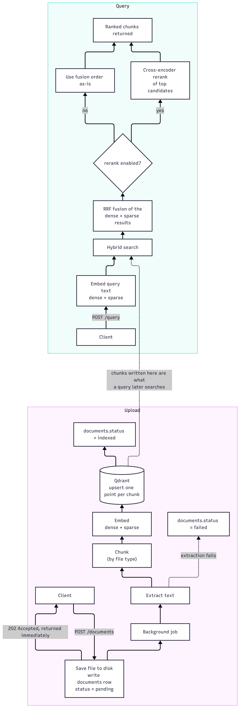

# Semantic retrieval pipeline design

This document covers the retrieval part of the platform — how a document goes
from an uploaded file to something you can semantically search, and how a
query turns into ranked results. For the API surface, the database schema and
scaling story, see [SYSTEM_DESIGN.md](SYSTEM_DESIGN.md).

The service does retrieval only. There is no generation step — a query
returns ranked chunks with their source metadata, not a synthesized answer.
That was a deliberate scope decision, not an oversight; adding an LLM answer
layer on top is a small addition once retrieval quality is solid, and I'd
rather get retrieval right first.

## How it fits together

Two separate flows share the same storage underneath — an upload fills the
index, a query reads from it. The diagram below shows both, and where they
meet (the Qdrant collection a query searches is exactly what an upload
writes into).

Upload is async because extraction and embedding can take anywhere from
under a second (a small code file) to well over a minute (a large PDF that
needs OCR, which is exactly what happened with the sample PDF used to test
this — more on that below). Making the client wait on that would mean either
a very long-lived HTTP request or a timeout, neither of which is a good
experience. So the upload endpoint just records the document and hands the
real work to a background task, and the client polls status.

## Chunking strategy

Different file types get chunked differently, because a PDF report, a
markdown doc and a Python file don't have the same idea of "a section."

**PDF and plain text** go through `unstructured`'s layout-aware partitioning
(`partition_pdf` / `partition_text`) followed by `chunk_by_title`, which
groups content under the section heading it belongs to and starts a new
chunk once it crosses a size threshold (1000 characters by default, with a
soft cutoff at 80% of that so chunks don't get padded right up to the edge).
Small fragments under 100 characters get merged into a neighboring chunk
rather than indexed on their own — otherwise you end up with a lot of
near-empty, low-value entries in the index.

For PDFs specifically, `unstructured` can run in a few different modes.
`hi_res` uses a layout detection model plus OCR and understands tables and
multi-column pages properly; `fast` just pulls the embedded text layer,
which is much quicker but has no idea about layout or tables. The pipeline
defaults to `auto`, which tries `hi_res` and falls back to `fast` if the
OCR dependencies (tesseract, poppler) aren't available. Worth knowing: I
tested this against the sample PDF in `problem_stmt/` and it turns out that
particular document has no embedded text layer at all — it's a design
export where the text is rendered rather than stored as text. `fast` mode
returns nothing for a document like that. `hi_res` is not really optional
for this kind of file; it's the only mode that can read it at all, since it
falls back to OCR. That's an operational dependency worth being explicit
about rather than discovering at deploy time.

Also while testing against that sample document, I noticed the page footer
(logo plus report title plus page number, repeated on every page) was
leaking into a third of the indexed chunks, tacked onto the end of real
content. `unstructured` doesn't reliably tag running headers and footers as
such on every document — on this one they landed inconsistently across a
few different element categories. So there's now a filtering pass before
chunking that looks for short text that repeats near-identically across a
large fraction of the document's pages and drops it. That's a general fix,
not specific to this one document's exact footer text.

**Markdown** is split on headers first (`#` through `####`), keeping the
header path in each chunk's metadata, and then a second pass enforces the
size limit on any section that's still too big. This means a chunk always
knows which section it came from, which the size-only splitters below
don't give you.

**Code** uses a language-aware recursive splitter that prefers to break on
class and function boundaries rather than mid-line. It handles about thirty
languages by mapping file extension to a LangChain `Language` enum. The one
thing this doesn't give you for free is context — a chunk that starts in
the middle of a class, at a method boundary, has no idea it belongs to that
class once it's separated from the class declaration. I ran into this
directly while testing against the sample Python file: a chunk containing
just `report_success(self, proxy)` on its own tells you nothing about which
class it's a method of. So there's a small pass that walks backward from
each chunk's position in the source and finds the nearest enclosing class
and function by indentation, then prefixes the chunk with a one-line
comment like `# class DecayProxyRotator > function get_proxy` before it
gets embedded. It's a cheap fix and it measurably helped — code queries
during testing correctly surfaced the right method with the right class
attached.

## Embedding lifecycle

Two embeddings are generated per chunk at ingest time and stored together
on the same Qdrant point: a dense vector from a sentence-transformers model
(`all-MiniLM-L6-v2`, 384 dimensions) and a sparse vector from FastEmbed's
BM25 implementation. The same pair gets generated again for the query text
at query time — there's no separate "query encoder," the same dense model
just encodes both sides.

Models are loaded once as lazy singletons and reused across requests rather
than reloaded per call, since loading a transformer model is not cheap.

One thing worth calling out plainly: the vector dimension is fixed when the
Qdrant collection is created. Swapping the dense model for a different one
later, or bumping to a higher-dimensional model, means creating a new
collection and reindexing everything — there's no online migration path
for that today. For a platform at the scale this is designed for (roughly
a hundred internal developers), that's an acceptable tradeoff, but it's the
kind of thing that should be a deliberate decision if it comes up later,
not an accident.

## Similarity search: why hybrid

Dense embeddings are good at catching semantic similarity — "how do I
recover a proxy's score" matching text about score recovery even without
matching words. They're not great at exact terms: a specific function name,
an error code, an acronym. Sparse (BM25) is the opposite — great at exact
term matches, no sense of meaning. Code and technical docs both lean
heavily on exact identifiers, so relying on dense search alone would miss
things a keyword search would catch immediately, and relying on BM25 alone
would miss anything phrased differently from how it's written in the
document.

Both searches run against Qdrant in a single request (Qdrant supports
named vectors per point, so dense and sparse live on the same point rather
than two separate collections), and the two ranked lists get combined with
Reciprocal Rank Fusion — each candidate's score is `1 / (60 + rank)` summed
across whichever list(s) it appears in, so something ranked highly in both
lists wins, and something present in only one list still gets counted
rather than thrown away. The 60 is RRF's usual constant; there wasn't a
strong reason to tune it away from the standard value.

## Vector database choice

Qdrant, running as its own server rather than in embedded/local mode. That
distinction matters more than the choice of Qdrant itself, honestly — the
earlier version of this service ran Qdrant embedded (opening the storage
directory directly in-process, similar to how SQLite works), which is
simple to set up but means only one process can hold that directory at a
time. That caps you at a single instance forever, which defeats the point
of asking how this scales. Moving Qdrant to its own container, accessed
over the network, means any number of application replicas can share one
collection, and Qdrant handles the concurrent writes itself instead of the
application having to serialize access with a lock.

The other reason for Qdrant specifically: native support for combining
dense and sparse vectors in one query with server-side fusion, which
avoids having to run two separate searches and merge them in application
code. It's open source, so there's no vendor dependency for something
that's explicitly meant to be an internal, self-hosted platform.

## Reranking

After the hybrid search returns its candidate pool (20 by default, this is
configurable per request), an optional second pass scores each candidate
against the query with a cross-encoder (`ms-marco-MiniLM-L6-v2`). A
cross-encoder looks at the query and the document text together, which is
slower than the independent embeddings used for the first pass but a good
deal more accurate at judging relevance, since it's not compressing each
side into a fixed vector before comparing them.

This is a real latency tradeoff and it's exposed as a request-level flag
(`rerank: true/false`) rather than baked in, on purpose. For a quick
exploratory query, raw fusion order might be good enough and faster. For
something where precision on the top few results actually matters, the
extra model call is worth paying for. Running this comparison directly
during testing showed the reranker does noticeably reorder results
compared to raw fusion, so it's not just adding latency for nothing.

## Failure handling

Every ingest job goes through the same state machine on the documents
table: `pending -> processing -> indexed` or `pending -> processing ->
failed`, with the error message recorded on the row. Documents are
processed independently of each other, so one bad file — corrupt PDF,
unsupported encoding, whatever — doesn't take down a batch upload that
included other valid files. If a document ends up with zero extractable
chunks, that's treated as a failure rather than silently indexed as an
empty, searchable-but-empty document; better to surface it than to have a
document sitting there looking successful with nothing behind it.

On the PDF side specifically, if the preferred `hi_res` extraction raises
(missing OCR dependencies, corrupt file, whatever), the code retries once
with the lighter `fast` strategy before giving up — a partial degradation
is better than failing outright when it's avoidable. That said, as noted
above, `fast` genuinely can't read every PDF; some documents (the sample
one included) have no text to extract that way at all, so the retry isn't
a guarantee, it's a best effort.

## Assumptions and tradeoffs

A few decisions here were made for the sake of keeping the system
understandable rather than chasing the theoretically optimal setup:

- One chunk size and overlap (1000 / 150 characters) applies across all
  file types rather than tuning per document type. It works reasonably
  well everywhere without needing a config table per file category, at the
  cost of not being perfectly tuned for any single one.
- One embedding model and one reranker model, both configured globally.
  No per-collection or per-tenant model choice. Simpler operationally, but
  means everyone shares the same quality/latency profile.
- Reranking always scores the full prefetch pool rather than trying to
  short-circuit early. Prefetch limit is the actual lever for controlling
  cost, not some smarter early-exit logic.
- Soft-deleted documents are filtered out of query results at query time
  by excluding their IDs from the search, rather than removed from the
  vector index immediately. This keeps delete fast and reversible, at the
  cost of Qdrant still holding vectors for soft-deleted documents until a
  hard delete actually removes them.
- There's no automatic re-embedding pipeline if the embedding model
  changes. That's a manual, deliberate operation, not something the system
  handles for you.

Related documents: [SYSTEM_DESIGN.md](SYSTEM_DESIGN.md) for the API,
database schema and scaling story.
