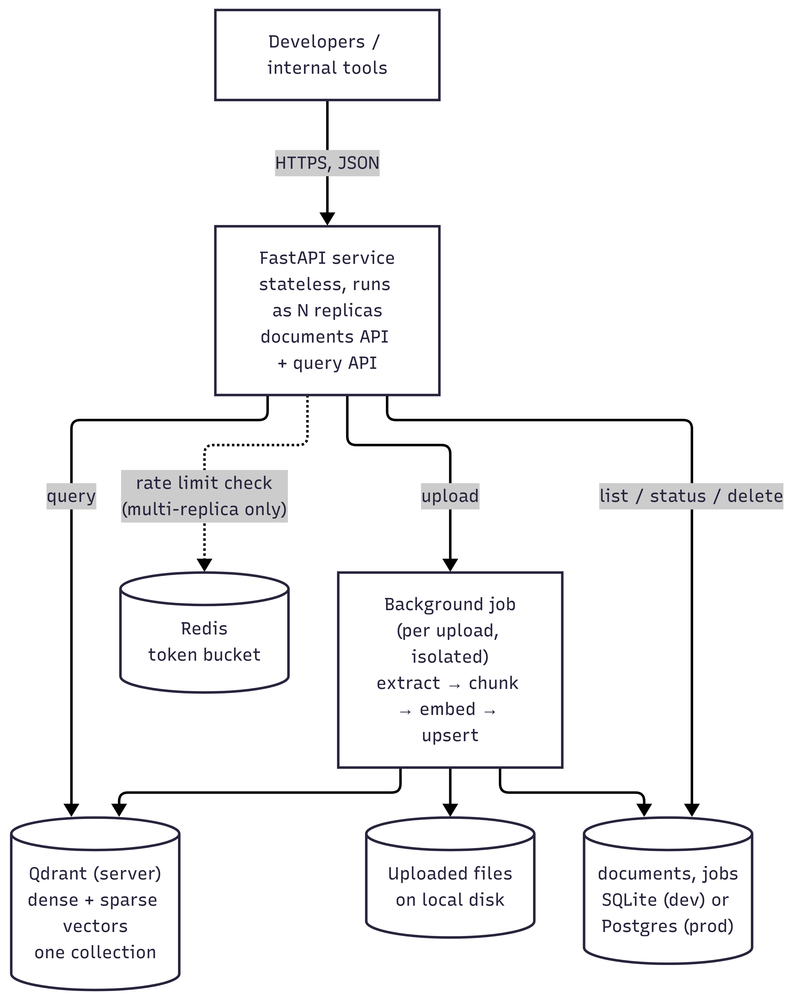

# System design — internal AI knowledge platform

This document covers the platform-level design: the API surface, the
database schema, and how the service is meant to scale. The retrieval
internals — chunking, embeddings, hybrid search, reranking — are covered
separately in [SEMANTIC_RETRIEVAL_PIPELINE_DESIGN.md](SEMANTIC_RETRIEVAL_PIPELINE_DESIGN.md), since that's
a different kind of design problem and mixing the two makes both harder to
follow.

## What this is

An internal service that lets developers upload documents and code files,
and query across everything that's been uploaded using natural language.
Built for internal use at the scale of roughly a hundred developers — not
a public-facing product, so some of the choices below (no auth layer, for
instance) are made with that scale and audience in mind and are called out
explicitly rather than glossed over.

## Architecture

The diagram shows both the components and how a request moves through
them — an upload branches off into a background job, a query goes straight
to Qdrant, a delete touches either just the metadata row (soft) or all
three stores (hard).



The service is stateless in the sense that matters for scaling: nothing
about a request depends on which replica handled the previous one. State
lives in three places — the relational store for document/job metadata,
Qdrant for vectors, and local disk for the original uploaded files. That
last one is the one place this design doesn't yet handle multi-replica
deployment cleanly, which is called out honestly in the scaling section
rather than pretended away.

## API design

REST over JSON, async where the work is heavy enough to matter. Four
endpoints cover the whole document lifecycle plus search.

### POST /documents — upload

Accepts one or more files in a single request (`files`, repeated), plus an
optional `metadata` field — a JSON object applied to every file in that
batch. Returns `202 Accepted` immediately; the actual extract/chunk/embed
work happens afterward, in the background.

Each file in the batch is validated and stored independently. A bad
extension or an empty file in the middle of a ten-file upload doesn't fail
the other nine — it's recorded as `rejected` with a reason, and the batch
response reports accepted and rejected counts alongside a per-file result
list:

```json
{
  "accepted": 2,
  "rejected": 1,
  "results": [
    { "filename": "report.pdf", "status": "pending",
      "document_id": "...", "job_id": "...",
      "message": "Document accepted for processing" },
    { "filename": "notes.md", "status": "pending",
      "document_id": "...", "job_id": "...",
      "message": "Document accepted for processing" },
    { "filename": "archive.zip", "status": "rejected",
      "document_id": null, "job_id": null,
      "message": "Unsupported file extension '.zip'" }
  ]
}
```

A file count cap per request (20 by default, configurable) exists mainly
so one request can't quietly bypass the per-minute rate limit by stuffing
an unbounded number of files into a single call.

Supported types: PDF, markdown, plain text, and roughly thirty code file
extensions.

### GET /documents — list

Returns all documents with their current status. Soft-deleted documents
are excluded unless `include_deleted=true` is passed.

### GET /documents/{id} — status

Returns the document row plus its most recent job (ingest or delete), so a
client can poll after upload until `status` moves to `indexed` or `failed`.

### DELETE /documents/{id} — soft or hard delete

Soft delete is the default (`DELETE /documents/{id}`) and just flags the
document — `status: deleted`, `deleted_at` set. The underlying file, the
metadata row, and the vectors in Qdrant are all left in place; the document
is simply excluded from future query results. It's fully reversible in the
sense that nothing has actually been destroyed yet.

Hard delete (`DELETE /documents/{id}?hard=true`) actually removes things,
in a specific order: vectors from Qdrant first, then the file on disk, then
the metadata row — and each step is isolated, so a failure partway through
doesn't lose track of what happened. If vector deletion fails, the
metadata row is deliberately kept (with `status: delete_failed` and the
error recorded) instead of being removed, specifically so the operation
can be retried later without orphaning vectors that no longer have a
metadata row pointing at them. The response reports the outcome of each
step separately:

```json
{
  "document_id": "...",
  "mode": "hard",
  "success": true,
  "steps": { "vectors": "ok", "file": "ok", "metadata": "ok" },
  "errors": [],
  "message": "Document permanently deleted"
}
```

### POST /query — semantic search

```json
{
  "query": "how does the proxy rotator recover score after a failure",
  "top_k": 5,
  "filters": { "file_type": "code", "language": "python" },
  "rerank": true
}
```

`filters` does exact-match filtering on chunk metadata — document id,
filename, file type, language, page number, and a few others, with list
values treated as OR. `rerank` toggles the cross-encoder pass described in
the RAG pipeline document; it's on by default and can be turned off for a
faster, slightly less precise response. The response includes both the
final score and the raw RRF fusion score per result, plus the chunk's
metadata, so a caller can see why something ranked where it did.

All four endpoints sit behind per-route rate limiting — tighter on upload,
since it triggers the expensive background pipeline, looser on read
operations. That's covered in the scaling section rather than repeated
here.

## Database schema

Two separate stores, because they hold fundamentally different kinds of
data and have different consistency needs: a relational store for
document and job metadata, and Qdrant for the vectors themselves. Trying
to force both into one system would mean either a vector database with
poor relational query support, or a relational database doing vector
search badly.

### documents table

| column | type | notes |
|---|---|---|
| id | string (uuid) | primary key |
| filename | string | original filename |
| file_type | string | pdf / markdown / text / code |
| file_path | string | where the uploaded file lives on disk |
| size_bytes | integer | |
| status | string | pending / processing / indexed / failed / deleted / delete_failed |
| metadata | json | arbitrary user-supplied tags from the upload call |
| num_chunks | integer | filled in once indexing finishes |
| error | string, nullable | set on failure |
| delete_error | string, nullable | set if a hard delete fails partway |
| created_at, updated_at | string (iso timestamp) | |
| deleted_at | string, nullable | set on soft delete |

`status` is really a small state machine (pending → processing → indexed
or failed, plus deleted / delete_failed as separate terminal-ish states for
the delete path), and most of the interesting logic in the ingest job and
the delete endpoint is really just moving a document through these states
correctly and recording why if something goes wrong.

### jobs table

| column | type | notes |
|---|---|---|
| id | string (uuid) | primary key |
| document_id | string | foreign key into documents |
| type | string | ingest / delete |
| status | string | pending / running / done / failed |
| error | string, nullable | |
| created_at, finished_at | string (iso timestamp) | |

Jobs are tracked separately from the document's own status rather than
folded into it, because a document can go through more than one job over
its lifetime (an ingest, later a retried hard delete), and keeping a
history of what actually ran — and when, and whether it succeeded — is
useful independently of "what does this document look like right now."
`GET /documents/{id}` returns the latest job alongside the document for
exactly this reason.

Both tables are defined as SQLAlchemy models and managed through Alembic
migrations rather than hand-written SQL or an auto-created schema on
startup. The reasoning is mostly about not having two different code paths
for SQLite in development and Postgres in production — the same models and
the same migrations apply to both, and moving from one to the other later
is a configuration change, not a rewrite. The application itself never
creates or alters tables at runtime; that's Alembic's job, run once as a
deploy step.

Indexes: `created_at` and `deleted_at` on documents (list queries sort by
the former and filter on the latter), `document_id` on jobs (status lookups
join through this). Nothing beyond that at this point — the table sizes
this design targets don't call for more, and adding indexes speculatively
tends to just slow down writes for no benefit.

### vector store (Qdrant)

One collection, one point per chunk. Each point carries two named vectors
— `dense` (384 dimensions, cosine distance) and `sparse` (BM25) — plus a
payload with the chunk's text and metadata: `document_id`, `filename`,
`file_type`, and whatever the specific chunker attached (`page_number` and
`element_type` for PDF chunks, `language`/`class_name`/`function_name` for
code chunks, header path for markdown). User-supplied upload metadata is
stored under a `meta_` prefix so it can't collide with these built-in
fields.

## Scaling strategy

The application layer is stateless and can run as multiple replicas behind
a load balancer without any coordination between them — nothing about
handling one request depends on state left behind by a previous one on a
different replica.

Qdrant runs as its own server, not embedded in the application process.
This sounds like a small detail but it's actually the main thing that
makes horizontal scaling possible at all — an embedded vector store opens
its storage directory directly and only one process can hold that lock at
a time, which caps the whole system at one instance no matter what else is
done. Running Qdrant as a separate service that the application connects
to over the network means any number of application replicas can share the
same collection, and Qdrant itself handles concurrent access.

The relational store scales the more conventional way: SQLite for local
development, a real Postgres instance in production, switched by
configuration (`RAG_ENVIRONMENT=production` plus connection settings, or a
single database URL) rather than by code change. SQLite is genuinely fine
for a single-instance deployment and makes local development simple; it
doesn't hold up under multiple writers hitting it concurrently, which is
exactly the case once there's more than one application replica, so
Postgres is what production actually needs.

Rate limiting follows the same pattern. By default it's a local, in-memory
token bucket per process — fine for one instance, but each replica would
enforce its own limit independently of the others, which stops meaning
much once there's more than one. Switching it to Redis-backed makes the
limit shared and accurate across every replica; the token bucket check
itself runs as a single atomic Lua script server-side, so concurrent
requests landing on different replicas can't race each other into
double-spending the same client's quota.

Two places this design doesn't yet have a clean scaling story for, stated
plainly rather than hidden:

Uploaded files are written to local disk. That's fine for one instance;
it isn't for several, since a file uploaded to one replica wouldn't be
visible to a background job that happens to run on another. The fix is
straightforward — move to shared object storage (S3 or equivalent) — but
it isn't built yet, and pretending otherwise would be misleading.

Background ingestion currently runs as a FastAPI background task inside
the same process that handled the upload request. That means the work is
tied to that process's lifetime — if it restarts mid-job, the job doesn't
resume, and there's no separate worker pool to scale ingestion throughput
independently of API traffic. The natural evolution here is a real task
queue (Celery, RQ, arq — something backed by Postgres or a broker) with
dedicated worker processes, so ingestion capacity scales independently of
how many API replicas are running, and jobs survive a restart. This is
probably the single highest-value next step for production readiness, more
so than most of the smaller items above.

Logging is structured JSON with a request id and duration attached to
every request, specifically so behavior can be correlated across replicas
once there's more than one — grepping a single log file doesn't work
anymore once there are several processes, and a shared, greppable request
id is what makes tracing a single request through the system possible in
that setting.

## Assumptions and tradeoffs

- No authentication or authorization anywhere in the API. This is built
  as an internal tool behind whatever network boundary the deployment
  already has, not as something exposed publicly. Adding auth (even
  something simple like an API key per team) would be one of the first
  things to add before this went further than internal use.
- Soft delete is the default specifically because reversibility matters
  more than reclaiming storage immediately for something that's meant to
  be a shared knowledge base — accidentally deleting a document that
  other people rely on should be easy to undo.
- Metadata filters are exact match only. There's no range filtering, no
  full-text filter query language, no fuzzy matching on filter values.
  That covers the common cases (scope to one document, one file type, one
  language) without building a filter query language nobody asked for.
- Rate limits (currently 10/minute on upload, 60/minute on query, applied
  per client IP and route) are reasonable starting numbers, not numbers
  backed by load testing against real traffic. They're meant to stop one
  client from monopolizing shared, expensive compute (embedding and
  reranking), not to be a precisely tuned final answer.
- Background job execution and local file storage both work fine at
  single-instance scale and both need the changes described above before
  this genuinely runs as several replicas in production. Better to say
  that directly than describe the current state as more scaled-out than
  it is.

Related documents: [RAG_PIPELINE_DESIGN.md](RAG_PIPELINE_DESIGN.md) for how
chunking, embeddings, hybrid search and reranking actually work.
